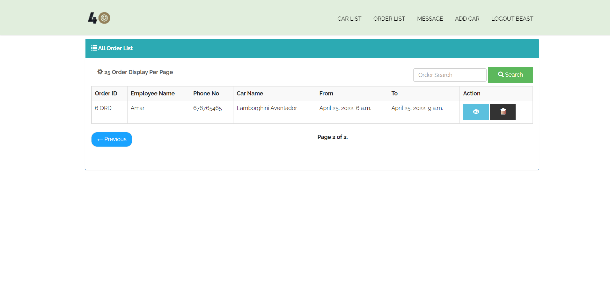

# fourwheel

A Car on Rent web application named Fourwheel made with the use of django framework, python language, sqilite database, Javascript, html and css.

## Features

- Easy Navigation
- Car Search
- Car List
- Add car
- Booking car 
- Order Updation 
- Admin View
- Order History
- Registraion 
- login

## Screenshots
<h3>HomePage</h3>

<h3>Footer</h3>

<h3>Registration</h3>

<h3>login</h3>

<h3>Services</h3>

<h3>Cars List</h3>

<h3>Add Car</h3>

<h3>Car detail</h3>

<h3>Car booking</h3>

<h3>Contact</h3>

<h3>Admin carlist</h3>

<h3>Order carlist</h3>

